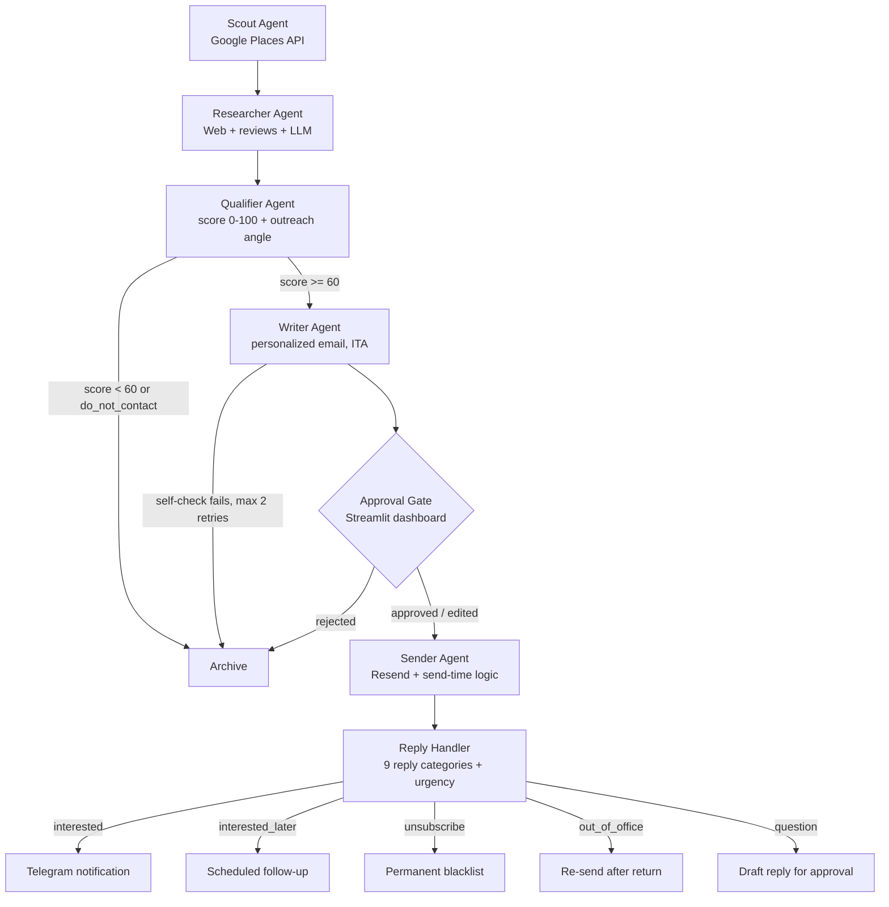

# ADH — AI-Driven Hunter

**Autonomous multi-agent pipeline for B2B outreach to Italian SMBs — with a mandatory human approval gate before any email is sent.**

[](https://python.org)
[](https://langchain-ai.github.io/langgraph/)
[](https://anthropic.com)
[](LICENSE)

ADH finds local businesses with repetitive manual processes, researches and scores them, writes a personalized outreach email in Italian, and handles replies — orchestrated as a LangGraph state machine where **no message leaves the system without explicit human approval**.

## Agent pipeline



Seven specialized agents plus an orchestrator (`adh/agents/`): **Scout → Researcher → Qualifier → Writer → Approval Gate → Sender → Reply Handler**, each with its own tools, prompts, and typed state.

## Key engineering decisions

- **Human-in-the-loop guardrail** — the approval gate is a hard stop in the graph, not a convention: the Sender agent is unreachable without an approve/edit action from the dashboard.
- **Typed graph state** — a single state model flows through the LangGraph nodes, making every transition explicit and testable.
- **Writer self-check loop** — generated emails are validated against quality rules (banned phrases, personalization checks); failures trigger a rewrite, max 2 retries, then archive.
- **Reply classification** — incoming replies are classified into 9 categories with urgency scoring, each mapped to a distinct automated or human action.
- **pgvector for retrieval** — company research is embedded in PostgreSQL/pgvector for deduplication and semantic lookup.
- **Cost-tiered models** — Claude Haiku for high-volume classification, Sonnet for writing and reasoning.
- **Compliance by design** — GDPR notes, unsubscribe blacklist, and contact policies documented in `COMPLIANCE.md` and `privacy.md`.

## Stack

Python 3.11 · LangGraph / LangChain · LangSmith (tracing) · Anthropic API · PostgreSQL + pgvector · SQLModel + Alembic · FastAPI · Playwright (research) · Streamlit (approval dashboard) · Resend (email) · pre-commit

## Getting started

```bash
git clone https://github.com/hajebzehir03-ai/ai-outreach-agent.git
cd ai-outreach-agent
cp .env.example .env    # Anthropic, Google Places, Resend, Postgres credentials
pip install -e .
python -m adh.cli --help
```

The approval dashboard runs with Streamlit; architecture notes and decision records live in `docs/`.

## Testing

```bash
pytest
```

The suite covers agents and tools (mocked LLM calls, state transitions, reply classification). Built through two audit-and-hardening rounds that grew coverage from 37% to 73%.

## License

MIT
