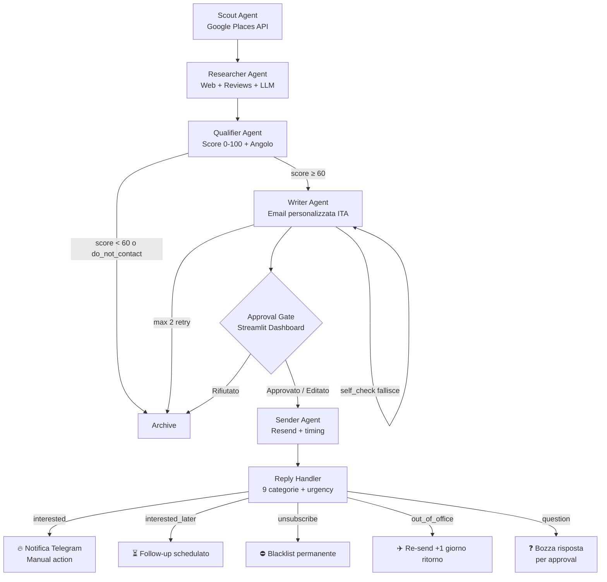

# ADH — AI-Driven Hunter

Agente AI autonomo per outreach B2B verso PMI italiane. Trova aziende con processi manuali ripetitivi, le qualifica, personalizza email in italiano e gestisce le risposte — con approvazione umana obbligatoria prima di ogni invio.

**Stack**: Python 3.11 · LangGraph · Claude Sonnet/Haiku · PostgreSQL + pgvector · Resend · Streamlit

---

## Architettura



---

## Quickstart

### 1. Prerequisiti
- Python 3.11+
- PostgreSQL 16 con estensione pgvector
- [uv](https://docs.astral.sh/uv/) per dependency management

### 2. Installazione

```bash
git clone https://github.com/tuousername/ai-outreach-agent
cd ai-outreach-agent
uv sync --extra dev
cp .env.example .env
# Compila le API key in .env
```

### 3. Database

```bash
# Avvia PostgreSQL locale (o usa un cloud provider)
uv run python -c "from adh.models.database import create_db_and_tables; create_db_and_tables()"
```

### 4. Dashboard

```bash
uv run streamlit run adh/dashboard/app.py
```

### 5. Webhook (reply handling)

```bash
uv run uvicorn adh.api.webhook:app --port 8000
# Configura il webhook URL in Resend: https://tuohost/webhook/resend
```

### 6. Scout manuale (test su un settore)

```bash
uv run adh run-scout --sector "Studi commercialisti" --region "Piemonte" --limit 20
```

---

## Struttura progetto

```
adh/
├── agents/
│   ├── state.py           # AgentState condiviso tra tutti i nodi
│   ├── orchestrator.py    # LangGraph state machine
│   ├── scout.py           # Sourcing Google Places
│   ├── researcher.py      # Enrichment web + LLM
│   ├── qualifier.py       # Score 0-100 + angolo pitch
│   ├── writer.py          # Email personalizzata + self_check
│   ├── sender.py          # Invio via Resend
│   └── reply_handler.py   # Classificazione 9 categorie
├── api/
│   └── webhook.py         # FastAPI endpoint Resend
├── config/
│   ├── settings.py        # Pydantic settings da .env
│   └── icp.yaml           # ICP configurabile
├── dashboard/
│   └── app.py             # Streamlit: approval queue, CRM, funnel
├── models/
│   ├── company.py         # SQLModel: Company
│   ├── intel.py           # SQLModel: CompanyIntel
│   ├── message.py         # SQLModel: OutreachMessage, ProcessingLog
│   └── database.py        # Engine + session
└── prompts/
    ├── scout.md
    ├── researcher.md
    ├── qualifier.md
    ├── writer.md           # ⭐ Contiene few-shot examples in italiano
    ├── reply_handler.md
    └── orchestrator.md
docs/
├── research/              # 10 schede competitor + summary
└── decisions/             # ADR (Architecture Decision Records)
tests/
└── agents/                # test_writer, test_qualifier, test_reply_handler
```

---

## Regole operative

| Regola | Valore |
|---|---|
| Max email/giorno | 30 (configurable) |
| Finestra invio | 9:00–18:00 lun–gio |
| Warm-up settimane 1-2 | 5-10 email/giorno |
| Follow-up | 2 max (dopo 4 e 10 giorni) |
| Blacklist permanente | Chi invia STOP |
| Score minimo | 60/100 |
| Evidence bullets minimi | 3 (altrimenti drop) |

---

## Kill switch

```bash
adh stop-all --reason "Cambio dominio outreach"
```

Blocca immediatamente tutti gli invii pianificati. Per riattivare: `KILL_SWITCH=false` in `.env` + restart.

---

## GDPR

Leggi [COMPLIANCE.md](COMPLIANCE.md) prima di avviare qualsiasi campagna.  
Pubblica [privacy.md](privacy.md) come pagina sul tuo sito e linka nella firma email.

**Non inviare mai a:**
- Email personali (Gmail, Libero, Yahoo)
- Aziende con `do_not_contact=true` nel profilo
- Aziende in blacklist

---

## Testing

```bash
uv run pytest -v
```

Coverage minima: 70%. I test sono progettati con LLM mockato — non richiedono API key reali.

---

## Roadmap

- **v0.1** — Pipeline completa email con approval gate ✅
- **v0.2** — Seconda fonte di sourcing (Pagine Gialle scraping)
- **v0.3** — LinkedIn follow-up via Computer Use
- **v0.4** — PostgreSQL checkpointer per LangGraph (invece di MemorySaver)
- **v0.5** — A/B test prompt Writer con versionamento `writer_v2.md`
